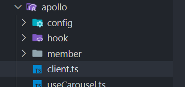

資料夾結構

client.ts

```js
import { ApolloClient, InMemoryCache, createHttpLink } from "@apollo/client";
import { setContext } from "@apollo/client/link/context";

import useTokenStore from "@/zustand/useTokenStore";
import { offsetLimitPagination } from "@apollo/client/utilities";

export const uri = "";

const httpLink = createHttpLink({
  uri,
});

const authLink = setContext((_, { headers }) => {
  const token = useTokenStore.getState().token;
  const authorization = token ? `Bearer ${token}` : "";

  return {
    headers: {
      ...headers,
      authorization,
    },
  };
});

const cache = new InMemoryCache({
  typePolicies: {
    Query: {
      fields: {
        members: offsetLimitPagination(),
        partners: offsetLimitPagination(),
        rewards: offsetLimitPagination(["enabled", "latest"]),
        posts: offsetLimitPagination(),
        videos: offsetLimitPagination(),
        forums: offsetLimitPagination(),
        partnerManagers: offsetLimitPagination(),
        rewardCategories: offsetLimitPagination(),
        points: offsetLimitPagination(["type", "latest"]),
      },
    },
  },
});

const client = new ApolloClient({
  link: authLink.concat(httpLink),
  cache,
});
export default client;
```
