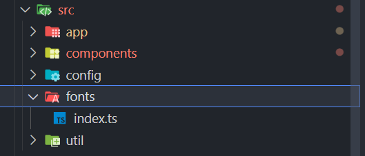

在專案目錄下建立一個`fonts`資料夾

新增 `index.ts`檔案

```tsx
import {
  Noto_Sans_TC,
  Noto_Sans_Mono,
  Noto_Serif_TC,
  Ibarra_Real_Nova,
  Archivo_Black,
  Italianno,
} from "next/font/google";

export const noto_sans_tc = Noto_Sans_TC({
  subsets: ["latin"],
  variable: "--font-noto-sans-tc",
  display: "swap",
});

export const archivo_black = Archivo_Black({
  subsets: ["latin"],
  weight: ["400"],
  variable: "--font-archivo-black",
  display: "swap",
});

export const italianno = Italianno({
  subsets: ["latin"],
  weight: ["400"],
  variable: "--font-italianno",
  display: "swap",
});
export const noto_serif_tc = Noto_Serif_TC({
  subsets: ["latin"],
  weight: ["200", "300", "400", "500", "600", "700", "900"],
  variable: "--font-noto-serif-tc",
  display: "swap",
});
export const noto_sans_mono = Noto_Sans_Mono({
  subsets: ["latin"],
  variable: "--font-noto-sans-mono",
  display: "swap",
});
export const ibarra_real_nova = Ibarra_Real_Nova({
  subsets: ["latin"],
  variable: "--font-ibarra-real-nova",
  display: "swap",
});
```

打開 `/app/layout.tsx` ，並編輯以下

```tsx
import type { Metadata } from "next";
import "./globals.css";
import clsx from "clsx";
import {
  noto_sans_tc,
  // noto_sans_mono,
  // noto_serif_tc,
  // archivo_black,
  // italianno,
} from "@/fonts";
export const metadata: Metadata = {
  title: "",
  description: "",
};

export default function RootLayout({
  children,
}: Readonly<{
  children: React.ReactNode;
}>) {
  return (
    <html lang="zh-Hant-TW" data-theme="light">
      <body
        suppressHydrationWarning
        className={clsx(
          "antialiased",

          noto_sans_tc.variable,
          // noto_serif_tc.variable,
          // noto_sans_mono.variable,
          // archivo_black.variable,
          // italianno.variable,
        )}
      >
        {children}
      </body>
    </html>
  );
}
```
