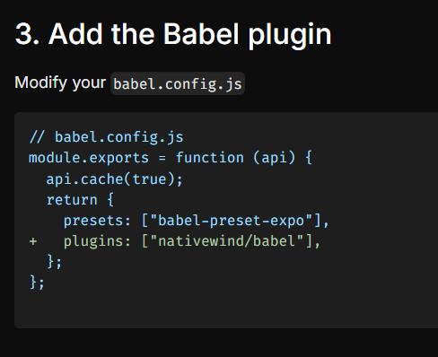
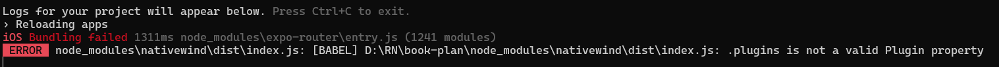
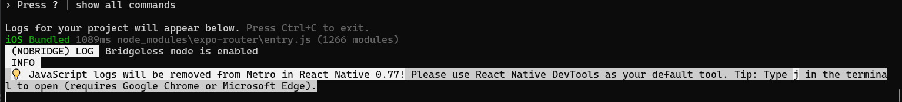

1. 透過 `create-expo-app` 指令建立 Expo 專案

```bash

npx create-expo-app my-app

```

2.到NativeWind官網依照步驟安裝

```bash

npm install nativewind
npm install --save-dev tailwindcss@3.3.2

```

https://www.nativewind.dev/v2/quick-starts/expo

Run `npx tailwindcss init` to create a `tailwind.config.js` file

3.這樣 `npm start` 會出現以下錯誤

https://stackoverflow.com/questions/77996575/babel-plugins-is-not-a-valid-plugin-property

接著會看到要設定babel，發現新版Expo預設沒產生這檔案，查了一下Expo說要自行透過以下指令產生配置檔



```bash
npx expo customize
```

```bash showLineNumbers{5}

module.exports = function (api) {
  api.cache(true);
  return {
    presets: ['babel-preset-expo'],
  };
};

```

用官方的指令安裝4.1.23

```bash

    "nativewind": "^4.1.23",
```

會出現以下報錯，所以就降為 `^2.0.11`才正常運作


Babel "plugins" is not a valid plugin property?



```bash showLineNumbers{13}

  "dependencies": {
    "@expo/vector-icons": "^14.0.2",
    "@react-navigation/native": "^7.0.14",
    "expo": "~52.0.28",
    "expo-font": "~13.0.3",
    "expo-linking": "~7.0.5",
    "expo-router": "~4.0.17",
    "expo-splash-screen": "~0.29.21",
    "expo-status-bar": "~2.0.1",
    "expo-system-ui": "~4.0.7",
    "expo-web-browser": "~14.0.2",
    "nativewind": "^2.0.11",
    "react": "18.3.1",
    "react-dom": "18.3.1",
    "react-native": "0.76.6",
    "react-native-reanimated": "~3.16.1",
    "react-native-safe-area-context": "4.12.0",
    "react-native-screens": "~4.4.0",
    "react-native-web": "~0.19.13"
  },

```

- [babel設定](https://docs.expo.dev/versions/latest/config/babel/)
- [版本問題](https://stackoverflow.com/questions/77996575/babel-plugins-is-not-a-valid-plugin-property)
- [className報錯問題](https://ithelp.ithome.com.tw/articles/10331212)
