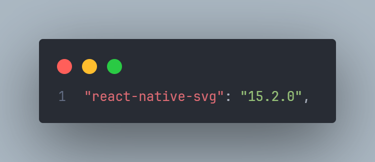

```tsx
export const SVG_String_1 = `
<svg width="30" height="31" viewBox="0 0 30 31" fill="none" xmlns="http://www.w3.org/2000/svg">
<circle cx="15" cy="15.4395" r="14.75" fill="#FCF8F1" stroke="#81923E" stroke-width="0.5"/>
<path d="M14.6349 8.16102C14.6709 8.09569 14.7238 8.04121 14.788 8.00327C14.8522 7.96533 14.9254 7.94531 14.9999 7.94531C15.0745 7.94531 15.1477 7.96533 15.2119 8.00327C15.2761 8.04121 15.329 8.09569 15.3649 8.16102L17.8249 12.831C17.8836 12.9392 17.9655 13.033 18.0647 13.1057C18.1639 13.1784 18.278 13.2283 18.3988 13.2517C18.5196 13.2752 18.644 13.2715 18.7632 13.2412C18.8824 13.2108 18.9934 13.1544 19.0883 13.076L22.6524 10.0227C22.7209 9.96703 22.8052 9.93453 22.8932 9.92985C22.9813 9.92517 23.0686 9.94855 23.1425 9.99664C23.2165 10.0447 23.2732 10.115 23.3047 10.1974C23.3361 10.2798 23.3406 10.3701 23.3174 10.4552L20.9558 18.9935C20.9076 19.1682 20.8037 19.3225 20.66 19.4329C20.5162 19.5432 20.3404 19.6037 20.1591 19.6052H9.84161C9.66023 19.6039 9.48421 19.5435 9.34027 19.4331C9.19634 19.3227 9.09236 19.1684 9.04411 18.9935L6.68328 10.456C6.66015 10.3709 6.66463 10.2807 6.69606 10.1983C6.7275 10.1159 6.78427 10.0456 6.8582 9.99747C6.93213 9.94939 7.01941 9.926 7.10748 9.93068C7.19555 9.93536 7.27986 9.96787 7.34828 10.0235L10.9116 13.0768C11.0064 13.1552 11.1175 13.2116 11.2367 13.242C11.3559 13.2724 11.4803 13.276 11.6011 13.2526C11.7219 13.2291 11.836 13.1793 11.9352 13.1065C12.0344 13.0338 12.1163 12.94 12.1749 12.8319L14.6349 8.16102Z" fill="#81923E" stroke="#81923E" stroke-width="0.5" stroke-linecap="round" stroke-linejoin="round"/>
<path d="M9.16663 22.9395H20.8333" stroke="#81923E" stroke-width="0.5" stroke-linecap="round" stroke-linejoin="round"/>
</svg>

`;
```

```tsx
import { SVG_String_1 } from "@/assets/svgs";
import { SvgXml } from "react-native-svg";
```

```tsx
<SvgXml width={20} height={20} xml={SVG_String_1} />
```
