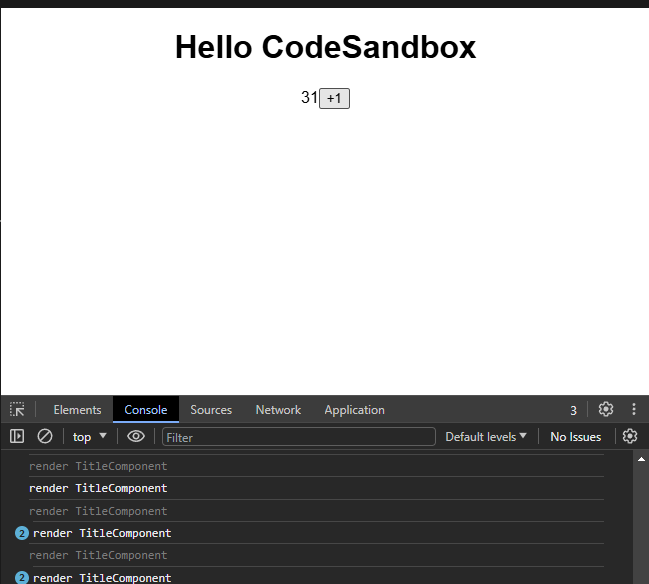
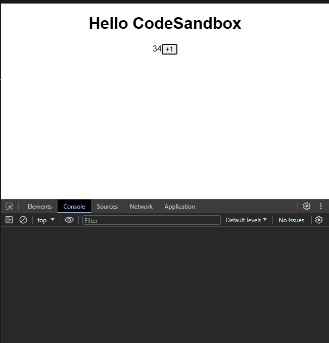

在 App 組件中，有個val狀態發生變化時 App組件就會重新渲染，但我們不希望`TitleComponent`標題組件也重新被建立一次
可以在標題組件內打印console可以確定他有被執行一次

```tsx showLineNumbers{15-18}
import { memo, useState } from "react";
import "./styles.css";

export default function App() {
  const [val, setVal] = useState(0);
  return (
    <div className="App">
      <TitleComponent />
      <span>{val}</span>
      <button onClick={() => setVal((v) => v + 1)}>+1</button>
    </div>
  );
}

function TitleComponent() {
  console.log("render TitleComponent");
  return <h1>Hello CodeSandbox</h1>;
}
```



React 有提供一個 `hook`叫做`memo` 可以將這個組件給鎖起來 避免因為外部狀態變化造成不必要的重新渲染

```tsx showLineNumbers{15-18}
import { memo, useState } from "react";
import "./styles.css";

export default function App() {
  const [val, setVal] = useState(0);
  return (
    <div className="App">
      <TitleComponent />
      <span>{val}</span>
      <button onClick={() => setVal((v) => v + 1)}>+1</button>
    </div>
  );
}

const TitleComponent = memo(function TitleComponent() {
  console.log("render TitleComponent");
  return <h1>Hello CodeSandbox</h1>;
});
```


