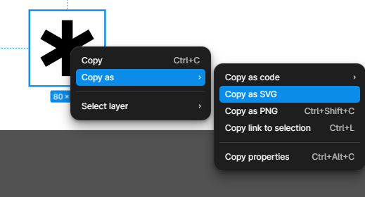

首先先將滑鼠點到想要匯出的地方，對其按下右鍵，出現選單，選擇`Copy as`，再點擊次選單，選擇`Copy as SVG`。

建立一個元件檔案
這邊會建立在 `/src/components/Svg/`

```jsx title="/src/components/Svg/back.svg"
import React from "react";

type SvgProps = JSX.IntrinsicElements["svg"];

function SvgComponent(props: SvgProps) {
  return (

  );
}
export default SvgComponent;
```

將剛剛複製的 SVG Code 貼上至`return` 地方

```jsx title="/src/components/Svg/back.svg" showLineNumbers {7-36}
import React from "react";

type SvgProps = JSX.IntrinsicElements["svg"];

function SvgComponent(props: SvgProps) {
  return (
    <svg
      width="24"
      height="24"
      viewBox="0 0 24 24"
      fill="none"
      xmlns="http://www.w3.org/2000/svg"
      {...props}
    >
      <g clip-path="url(#clip0_3012_9011)">
        <path
          d="M7.5 12.75L3 8.25L7.5 3.75"
          stroke="#616161"
          stroke-width="1.5"
          stroke-linecap="round"
          stroke-linejoin="round"
        />
        <path
          d="M7.5 18.75H15.75C17.1424 18.75 18.4777 18.1969 19.4623 17.2123C20.4469 16.2277 21 14.8924 21 13.5C21 12.1076 20.4469 10.7723 19.4623 9.78769C18.4777 8.80312 17.1424 8.25 15.75 8.25H3"
          stroke="#616161"
          stroke-width="1.5"
          stroke-linecap="round"
          stroke-linejoin="round"
        />
      </g>
      <defs>
        <clipPath id="clip0_3012_9011">
          <rect width="24" height="24" fill="white" />
        </clipPath>
      </defs>
    </svg>
  );
}
export default SvgComponent;
```

```jsx title="/src/components/Svg/back.svg" showLineNumbers {11,18,25}
import React from "react";

type SvgProps = JSX.IntrinsicElements["svg"];

function SvgComponent(props: SvgProps) {
  return (
    <svg
      width="24"
      height="24"
      viewBox="0 0 24 24"
      fill="none"
      xmlns="http://www.w3.org/2000/svg"
      {...props}
    >
      <g clip-path="url(#clip0_3012_9011)">
        <path
          d="M7.5 12.75L3 8.25L7.5 3.75"
          stroke="#616161"
          stroke-width="1.5"
          stroke-linecap="round"
          stroke-linejoin="round"
        />
        <path
          d="M7.5 18.75H15.75C17.1424 18.75 18.4777 18.1969 19.4623 17.2123C20.4469 16.2277 21 14.8924 21 13.5C21 12.1076 20.4469 10.7723 19.4623 9.78769C18.4777 8.80312 17.1424 8.25 15.75 8.25H3"
          stroke="#616161"
          stroke-width="1.5"
          stroke-linecap="round"
          stroke-linejoin="round"
        />
      </g>
      <defs>
        <clipPath id="clip0_3012_9011">
          <rect width="24" height="24" fill="white" />
        </clipPath>
      </defs>
    </svg>
  );
}
export default SvgComponent;
```

# 如何可以透過引用時方便傳入 SVG 屬性呢?

可以將`stroke` 、 `fill` 移除，其餘 SVG Props 可以參考 W3C 網站資源

```jsx title="/src/components/Svg/back.svg" showLineNumbers {11,18,25}
import React from "react";

type SvgProps = JSX.IntrinsicElements["svg"];

function SvgComponent(props: SvgProps) {
  return (
    <svg
      width="24"
      height="24"
      viewBox="0 0 24 24"
      xmlns="http://www.w3.org/2000/svg"
      {...props}
    >
      <g clip-path="url(#clip0_3012_9011)">
        <path
          d="M7.5 12.75L3 8.25L7.5 3.75"
          stroke-width="1.5"
          stroke-linecap="round"
          stroke-linejoin="round"
        />
        <path
          d="M7.5 18.75H15.75C17.1424 18.75 18.4777 18.1969 19.4623 17.2123C20.4469 16.2277 21 14.8924 21 13.5C21 12.1076 20.4469 10.7723 19.4623 9.78769C18.4777 8.80312 17.1424 8.25 15.75 8.25H3"
          stroke-width="1.5"
          stroke-linecap="round"
          stroke-linejoin="round"
        />
      </g>
      <defs>
        <clipPath id="clip0_3012_9011">
          <rect width="24" height="24" fill="white" />
        </clipPath>
      </defs>
    </svg>
  );
}
export default SvgComponent;
```

```jsx
import BackSvg from "@/components/Svg/Back";
function TestArea() {
  return (
    <div>
      <BackSvg classname="" stroke={"#000"} />
    </div>
  );
}
```

[參考資源](https://www.w3schools.com/graphics/svg_intro.asp)
https://www.w3schools.com/graphics/svg_intro.asp
